# OCARR

## Operator Conditioned Adaptive Randomized Reconstruction for Phased Array Radar Super Resolution Imaging in Low-Altitude Remote Sensing

This repository provides the figures and processed numerical results accompanying the manuscript **“Operator Conditioned Adaptive Randomized Reconstruction for Phased Array Radar Super Resolution Imaging in Low-Altitude Remote Sensing.”**

**Authors:** Xiangxiang Wang, Haining Yang, Yebo Wang, Na Li, and Yujian Cheng  
**Corresponding author:** Haining Yang (`hnyang@uestc.edu.cn`)

> **One-sentence summary:** OCARR combines a direction-dependent two-sided radar forward model, operator-conditioned randomized echo denoising, block-adaptive rank selection, and ROI-constrained sparse reconstruction to improve angular resolution and computational efficiency under spatially nonstationary and low-SNR conditions.

## At a glance

- **Problem:** Closely spaced ground scatterers merge because the angular resolution of a millimeter-wave phased array radar is limited by its physical aperture. A shift-invariant point-spread function cannot represent the direction-dependent beam pattern across a wide scan sector.
- **Forward model:** The measured echo is modeled as $Y=KXG+N$, where $K$ is the range-response operator, $G$ contains the direction-dependent phased-array patterns, $X$ is the scene scattering distribution, and $N$ is additive noise.
- **Core method:** OCARR uses operator-conditioned two-sided randomized sketching (OCS), block-adaptive rank selection (BARS), and adaptive ROI-constrained FISTA (ARF).
- **Validation:** Controlled simulations at 25, 17.5, and 10 dB SNR, component ablations, and two low-altitude field experiments using a developed 94 GHz 16-element phased-array radar.
- **Repository contents:** Processed MATLAB data (`.mat`) and rendered figures (`.png`) for the results reported in the manuscript.

## Method overview

```mermaid
flowchart LR
    A[Measured echo Y<br/>Calibrated operators K and G] --> B[Two-sided forward model<br/>Y = KXG + N]
    B --> C[Overlapping echo blocks]
    C --> D[OCS<br/>Operator-conditioned row and column sketches]
    D --> E[BARS<br/>Local rank selection for strong, weak, and noise regions]
    E --> F[Denoised echo Yde]
    F --> G[Full-image FISTA warm start]
    G --> H[Threshold and dilate support<br/>Form rectangular ROIs]
    H --> I[ARF<br/>ROI-constrained FISTA refinement]
    I --> J[Super-resolved scattering map X]
```



| Component | Role | Main motivation |
|---|---|---|
| **TSFM** | Represents range and azimuth responses as separate operators in $Y=KXG+N$ | Retains the direction-dependent array pattern without forming an $mn\times mn$ vectorized operator |
| **OCS** | Shapes Gaussian probes using $K$ and $G$ before randomized row/column subspace formation | Couples randomized echo denoising to the calibrated acquisition physics |
| **BARS** | Selects a truncation rank for each overlapping echo block | Preserves weak returns while suppressing noise in spatially nonstationary scenes |
| **ARF** | Switches from an initial full-image FISTA estimate to updates over detected target-bearing ROIs | Avoids spending later iterations on background pixels |

The two-sided model requires approximately $O(mn(m+n))$ multiplication operations, compared with $O(m^2n^2)$ for a fully vectorized $mn\times mn$ formulation.

## Headline simulation results

The simulated range–azimuth scene covers 0–48 m and $-40^\circ$–$40^\circ$ on a $256\times256$ grid. It contains five target pairs (10 targets) with different separations, amplitudes, and positions across the scan sector.

### Complete OCARR configuration

| SNR | Angular resolution | Target recovery ratio | Mean location error | SSIM | False energy ratio | Runtime |
|---:|---:|---:|---:|---:|---:|---:|
| 25 dB | **0.94°** | **10/10** | **0.80 px** | 0.99 | **0.002** | **12.0 s** |
| 17.5 dB | **0.94°** | **9/10** | 1.44 px | **0.99** | 0.073 | **21.9 s** |
| 10 dB | **2.20°** | **8/10** | 1.71 px | **0.95** | 0.428 | **30.7 s** |

Angular resolution is evaluated using P1 and P2 while varying their angular separation. A target is counted as recovered when a reconstruction lies within five pixels of its reference position.

### Comparison with reference methods

Each entry reports **target recovery ratio / runtime**. The regularization type, iteration settings, and MAP optimizer are held consistent at each SNR.

| SNR | TRD | TSVD | TS-RSVD | OCARR |
|---:|---:|---:|---:|---:|
| 25 dB | 7/10 / 109.3 s | 7/10 / 95.5 s | 3/10 / 37.8 s | **10/10 / 12.0 s** |
| 17.5 dB | 4/10 / 107.5 s | 7/10 / 95.3 s | 2/10 / 40.2 s | **9/10 / 21.9 s** |
| 10 dB | 0/10 / 108.1 s | 1/10 / 94.7 s | 0/10 / 39.8 s | **8/10 / 30.7 s** |

### Low-SNR visual comparison (10 dB)

<table>
  <tr>
    <th width="50%">TS-RSVD baseline</th>
    <th width="50%">OCARR</th>
  </tr>
  <tr>
    <td></td>
    <td></td>
  </tr>
</table>

## Ablation summary

The TS-RSVD baseline uses isotropic Gaussian sketching, one global truncation rank, the two-sided forward model, and full-image FISTA. OCS, BARS, and ARF are then added individually and in combination.

- **OCS improves two-sided subspace capture.** The global projection residual $\lVert Y-P_LYP_R\rVert_F$ decreases from 16.96 to 14.67 at 25 dB, from 35.57 to 33.77 at 17.5 dB, and from 81.37 to 80.66 at 10 dB. The same ordering is observed for every target-pair block.
- **BARS provides the largest individual recovery gain.** Relative to TS-RSVD, the target recovery ratio rises from 3/10, 2/10, and 0/10 to 8/10, 8/10, and 7/10 at 25, 17.5, and 10 dB, respectively.
- **ARF reduces the optimization time after support estimation.** Used alone on the baseline, it changes the runtimes from 37.8, 40.2, and 39.8 s to 16.8, 22.7, and 34.9 s, respectively.
- **The components are complementary.** The complete OCS+BARS+ARF configuration reaches 10/10, 9/10, and 8/10 recovered targets across the three SNRs.

## Radar platform and field experiments

| Parameter | Value |
|---|---:|
| Carrier frequency | 94 GHz |
| Bandwidth | 400 MHz |
| Range resolution | 0.375 m |
| Sampling rate | 4 MSPS |
| Chirp duration | 4 ms |
| Number of chirps | 8 |
| Array elements | 16 |
| Azimuth scan range | ±38.7° |
| Scan interval | approximately 2° |
| Broadside 3-dB beamwidth | 6.7° |

Two low-altitude scenes test different sensing ranges and oblique angles. OCARR produces sparse scattering distributions aligned with the reference island and shoreline contours and completes the reconstructions in 29.6 s and 30.1 s.

| Method | Field 1 | Field 2 |
|---|---:|---:|
| TRD | 50.3 s | 48.0 s |
| TSVD | 47.2 s | 45.8 s |
| TS-RSVD | 40.4 s | 38.5 s |
| **OCARR** | **29.6 s** | **30.1 s** |

<table>
  <tr>
    <th width="50%">Field 1: long range, high oblique angle</th>
    <th width="50%">Field 2: short range, low oblique angle</th>
  </tr>
  <tr>
    <td></td>
    <td></td>
  </tr>
</table>

The red dashed curves in the field-result figures mark the reference island and shoreline contours.

## Repository organization

```text
OCARR/
├── Angle resolution test/
│   ├── 25dB/
│   │   ├── Data/       # MATLAB reconstruction results
│   │   └── Figure/     # PNG visualizations
│   ├── 17.5dB/
│   └── 10dB/
├── Comparison and ablation study/
│   ├── 25dB/
│   │   ├── Data/       # Noisy echo and reconstruction/ablation results
│   │   └── Figure/     # Corresponding PNG visualizations
│   ├── 17.5dB/
│   └── 10dB/
├── Field Experiments/
│   ├── Data/           # Processed reconstruction results for two scenes
│   └── Figure/         # Echo and reconstruction visualizations
└── README.md
```

### Direct navigation

- [Angular-resolution tests](Angle%20resolution%20test/)
- [Simulation comparison and ablation study](Comparison%20and%20ablation%20study/)
  - [25 dB](Comparison%20and%20ablation%20study/25dB/)
  - [17.5 dB](Comparison%20and%20ablation%20study/17.5dB/)
  - [10 dB](Comparison%20and%20ablation%20study/10dB/)
- [Low-altitude field experiments](Field%20Experiments/)

## Filename key

The repository preserves the original experiment filenames. The following tokens identify the compared configurations:

| Token | Meaning |
|---|---|
| `TRD` | Traditional/reference deconvolution baseline |
| `TTRD` | TSVD baseline shown in the manuscript |
| `nophy_noblcok_noroi` | TS-RSVD baseline: isotropic sketching, global rank, full-image FISTA |
| `phy` / `nophy` | Operator-conditioned sketching enabled / isotropic sketching used |
| `blcok` / `noblcok` | Block-adaptive rank selection enabled / one global rank used |
| `roi` / `noroi` | ROI-constrained FISTA enabled / full-image FISTA used |
| `phy_blcok_roi` | Complete OCARR configuration |

> `blcok` is the spelling used in the original filenames and is intentionally retained so that links remain valid.

## Loading the data

The `.mat` files can be inspected directly in MATLAB. For example:

```matlab
dataFile = fullfile("Comparison and ablation study", "25dB", ...
    "Data", "25dB_phy_blcok_roi_Xhat.mat");

whos("-file", dataFile);   % list the variables stored in the file
result = load(dataFile);    % load the processed OCARR reconstruction
```

The `.png` file with the same stem is the rendered version used for visual inspection.

## Evaluation metrics

- **AR (angular resolution):** minimum angular separation at which two equal-amplitude targets at the same range are resolved.
- **TRR (target recovery ratio):** fraction of targets reconstructed within five pixels of their reference positions.
- **MLE (mean location error):** mean pixel error over the recovered targets.
- **SSIM:** structural similarity between the reconstructed and reference scattering distributions.
- **FER (false energy ratio):** reconstructed energy assigned to non-target regions.
- **Runtime:** processing time from the echo to the reconstructed image under the experimental setup used in the manuscript.

## Scope of this release

The current public release contains the processed numerical results and figures used to inspect the manuscript's simulation, ablation, angular-resolution, and field-experiment evidence. It does **not** currently include the OCARR source code, raw field measurements, or a complete executable reproduction environment. Runtime values are therefore the measurements reported in the manuscript and may vary with hardware and software configuration.

## Citation

If this repository is useful in your work, please use the following provisional citation until the final publication record is available:

```bibtex
@misc{wang2026ocarr,
  author = {Xiangxiang Wang and Haining Yang and Yebo Wang and Na Li and Yujian Cheng},
  title  = {Operator Conditioned Adaptive Randomized Reconstruction for Phased Array Radar Super Resolution Imaging in Low-Altitude Remote Sensing},
  year   = {2026},
  note   = {Manuscript}
}
```

## License and reuse

No license file is currently included in this repository. Please contact the authors before redistributing or reusing the data or figures.
